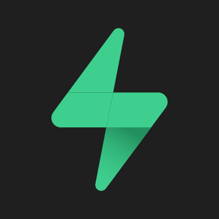

# Godot Engine - Supabase Examples

A library containing some examples made with Godot Engine as a client for Supabase backend.  
Examples are developed using [fenix-hub/godot-engine.supabase](https://github.com/fenix-hub/godot-engine.supabase) plugin for Godot Engine.

### List of examples
- [**ToDot List**](/todo-list) (Multiplatform Todo list - following [Todo list demo](https://github.com/supabase/supabase/tree/master/examples/nextjs-todo-list) by [supabase](https://supabase.io/))
- [**gdChat**](/realtime-chat) (Multiplatform Realtime chat - following [Chat demo](https://github.com/supabase/supabase/tree/master/examples/nextjs-slack-clone) by [supabase](https://supabase.io/))
- [**Godotgram**](/instagram-clone) (Multiplatform Instagram Clone)

### List of web demo
- [**web ToDot List**](https://github.com/fenix-hub/godot-engine.supabase-examples/tree/main/todo-list/export/html/demo.html)
- [**web GDChat**](https://github.com/fenix-hub/godot-engine.supabase-examples/tree/main/realtime-chat/export/html/demo.html)
- [**web Godotgram**](https://github.com/fenix-hub/godot-engine.supabase-examples/tree/main/instagram-clone/export/htmldemo.html)

### Folder structure
Each example consists of its *source code* (in `/source`) written in gdscript plus some *exported binaries* (in `/export`) for different platforms (ex. Windows, Android, Linux, HTML).  
Also, each example has a self hosted HTML demo available to test it from mobile and desktop platforms.